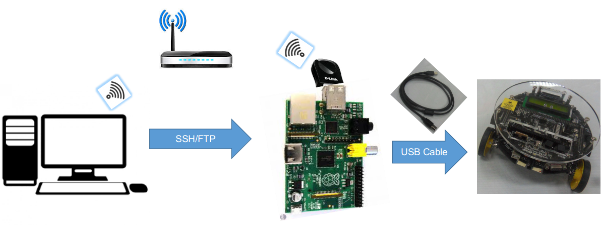

*******************
How to use the API
*******************

.. role:: python(code)
    :language: python

The api provides two levels of abstraction one I/O register control and second a higher peripheral level control.

Setup
-------------------

- Connect the system as shown in the figure above.

- Before using the api, load the firmware in the firebird V robot. This firmware is present at source/firmware_ver_1/firmware_ver_1.hex.

- With robotapi installed, you can import it using:

.. code:: python

	import robotapi as rb

Low Level Abstraction
-------------------------

The function config_register() from the Atmega class will provide control over the I/O ports of the microcontroller.

To use it,

.. code:: python

	from robotapi import Atmega as at

To access a PORT register of Port J, you can do the following:

.. code:: python

	at.config_register('PortJ', Pins=[1, 2], set_pins=True)

To access Data direction i.e. DDR register of an I/O port, use

.. code:: python

	at.config_register('DDRJ', Pins=[1, 2], set_pins=False)

All the pins numbers mentioned inside the list of Pins will be set to logic'1' if 
set_pins=True and logic'0' if False

High Level Abstraction
-------------------------

A number of functions in classes Buzzzer and Motion provide a peripheral level abstraction for motion and buzzer control

To use them

.. code:: python

	 from robotapi import Atmega
	 from robotapi import Buzzer as Buzz
	 from robotapi import Motion as motion

You can use them as folloes

To turn ON buzzer for 5 seconds
 
.. code:: python

	 Buzz.on(5)
 
 To turn OFF buzzer

.. code:: python
 	
 	 Buzz.off()

An example of motion control

.. code:: python

	 motion.forward()

This function call moves the robot forward, apart from this left, right, stop, soft-left and soft-right is also possible using corresponding function calls.

Refer to the `api documentation`_ for more information about these functions.

.. _api documentation: http://sdes-2016-project2.readthedocs.io/en/latest/modules.html

